Bulk Add MetaDataTag and Export/Import Selected MetaDataTag from *.JPG to Other *.JPG from file *.csv on Exiftool.

"Assume that you are in this Context, If this isn't clear, pause and continue this video."

1. I have three photos in the folder '/sdcard/DCIM/Camera'

2. Then I will go to Directory '/sdcard/DCIM/Camera'
    ```sh
    cd '/sdcard/DCIM/Camera' 
    ```
    ```sh
    ls
    ```
    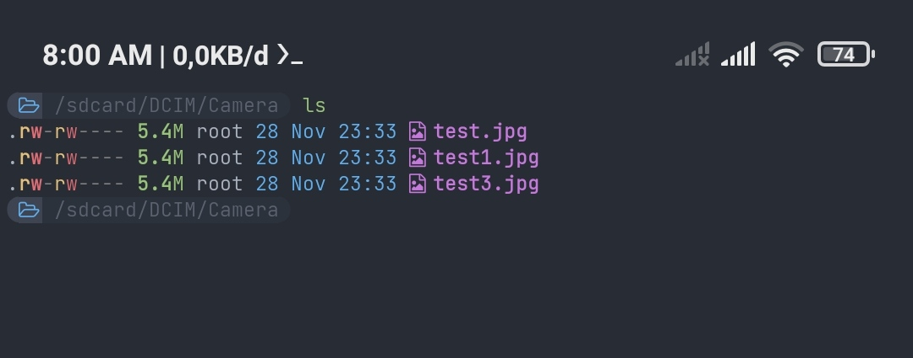

3. I will see all the data GeoTag Photos in the 'camera' folder using the command
    ```sh
     exiftool -GPSPosition .
     ```
     The '_dot_' function in the command above functions to '_show the current folder_' and '_-GPSPosition_' Functions to retrieve and display the value of the photo coordinate position
     
     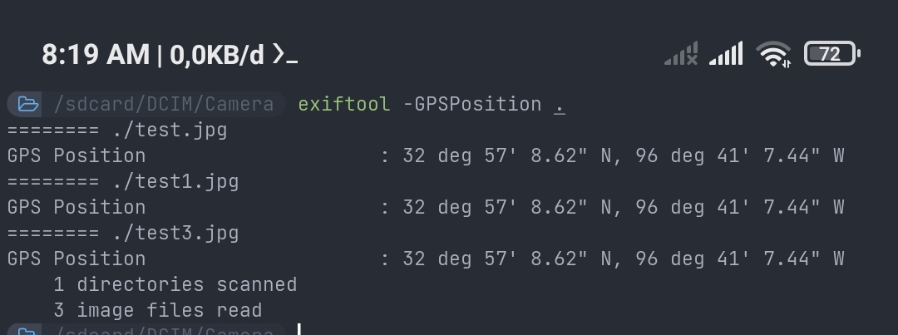
     
4. I will add a Description Tag to all photos with the command
    ```sh
     exiftool -imagedescription="Some Description" 
     ```
     *At this point, this is just a Bonus knowledge for adding Tags and filling new values into Photo.
     
     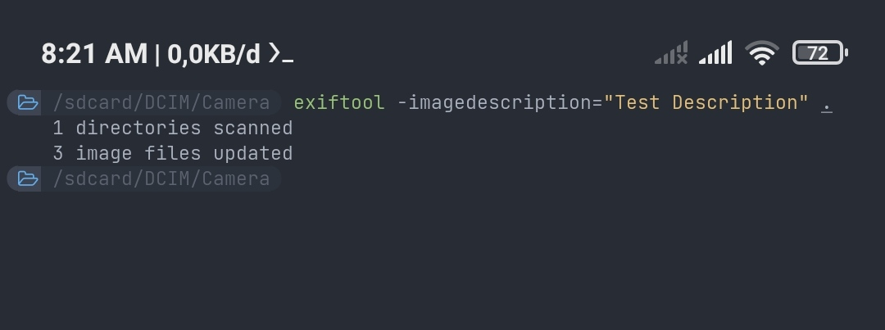
     
     Looking at the photo description according to the expectations of the changes.
     ```sh
     exiftool -imagedescription .
     ```
     
     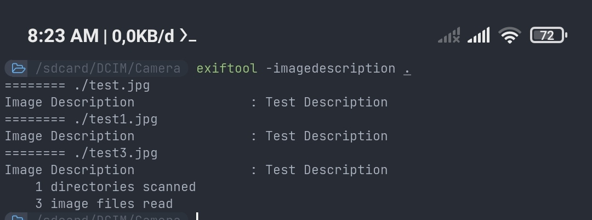


5. Then I will retrieve some data that I need, In this context I will take Geolocation data on the photo and then export it to *.csv file. I use command
    ```sh
    exiftool -GPSPosition -csv . >> exifdata.csv
    ```
    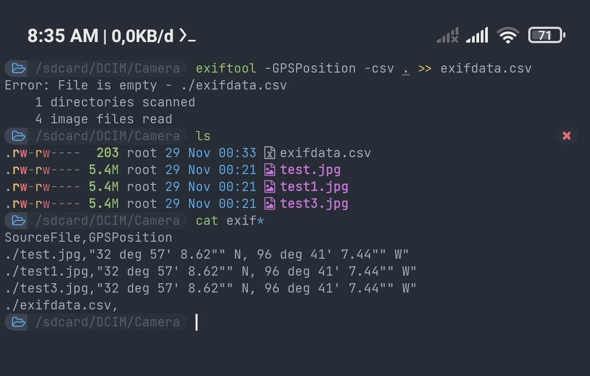

6. I will open the *.csv reader application to make it easier for me to edit the contents of the document. At this stage I manipulate the GPSPosition data with the coordinates that I have specified.
I opened it "exifdata.csv" using Snapsheet from WPS

    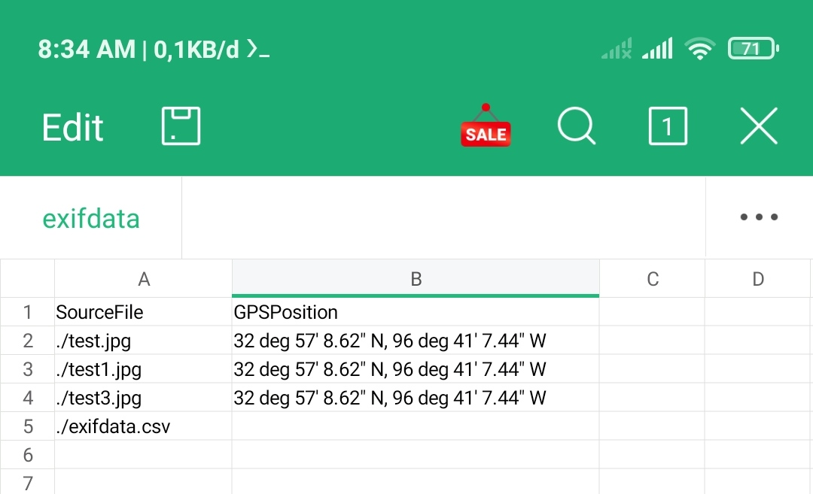
Little explanation *You can skip reading below and continue to the next point*:
You need to know that there are several types of GeoLocation Formatting:
    - ‌Decimal degrees (DD): 41.40338, 2.17403
    - ‌Degrees, minutes, and seconds (DMS): 41°24'12.2"N 2°10'26.5"E
    - ‌Degrees and decimal minutes (DMM): 41 24.2028, 2 10.4418

    exiftool exports files in DMS format but you can change the GeoLocation format value in -GPSPosition by using DD Formatting
    Example of inserting 'DD' format GeoLocation values directly into all photos using the exiftool command directly:
    ```sh 
    exiftool -GPSPosition="33.0290801, -96.6587581" .
    ```
    I use Alpinequest in retrieving coordinates
    
    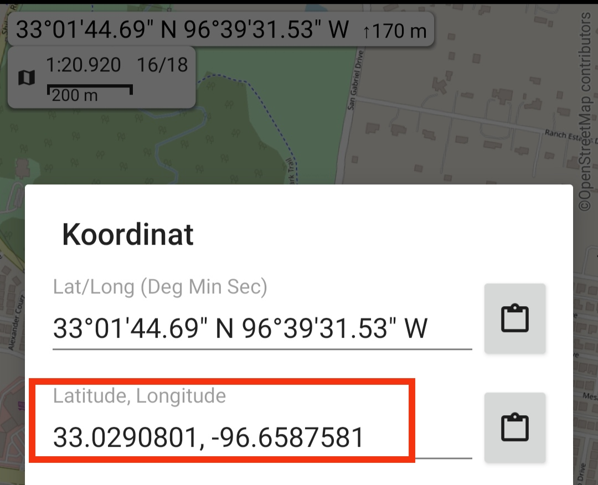
    
    Example Result:
    Check the results of all photos to see if the Geotag has changed by using a specific command:
    ```sh
    exiftool -GPSPosition .
    ```
    
    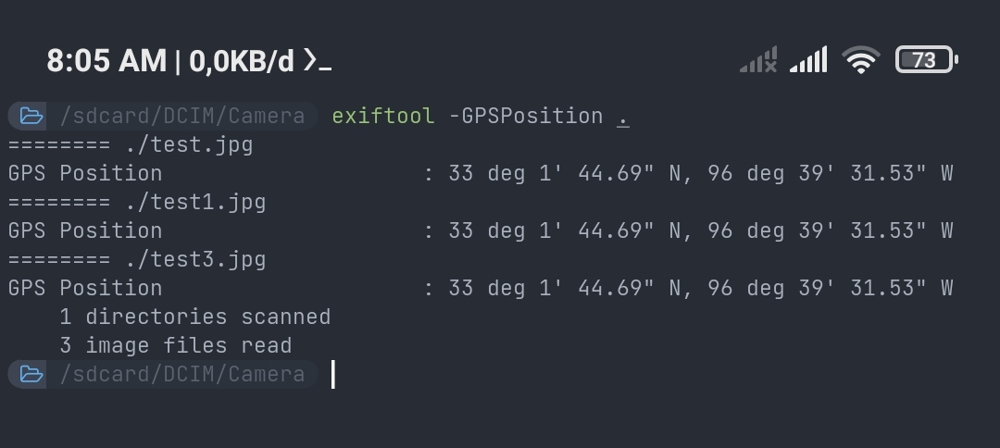
    
    
7. To make this method faster, I have prepared three different coordinates obtained from Alpinest Quest and I hope you know how to get the coordinates for yourself.
    Example of DD coordinates that I will enter:
    1. _32.8925547, -96.6099482_
    2. _32.7661699, -96.7681055_
    3. _32.4968547, -96.942174_
    
    **Before**:
    
    
    
    **After**:
    
    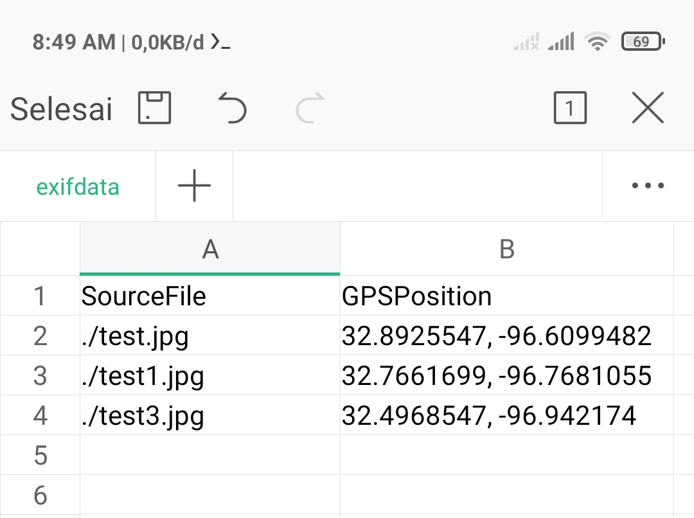
    
    Then I will enter the data from "**_exifdata.csv_**" into the existing photos,In this context I will put it back into the three photos By using commands.
    ```sh
    exiftool . -csv=./exifdata.csv
    ```
    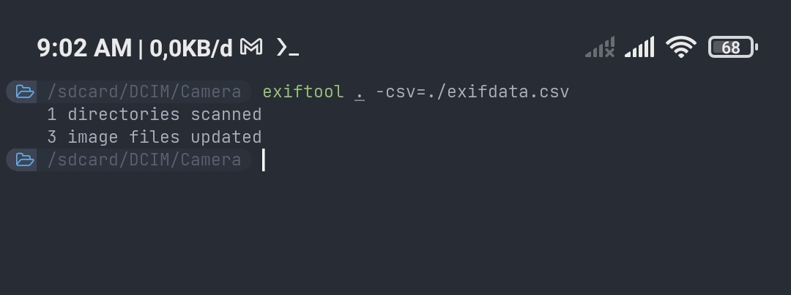

   Check the results of the coordinate changes in the photos:
   
    **Before**:
    
    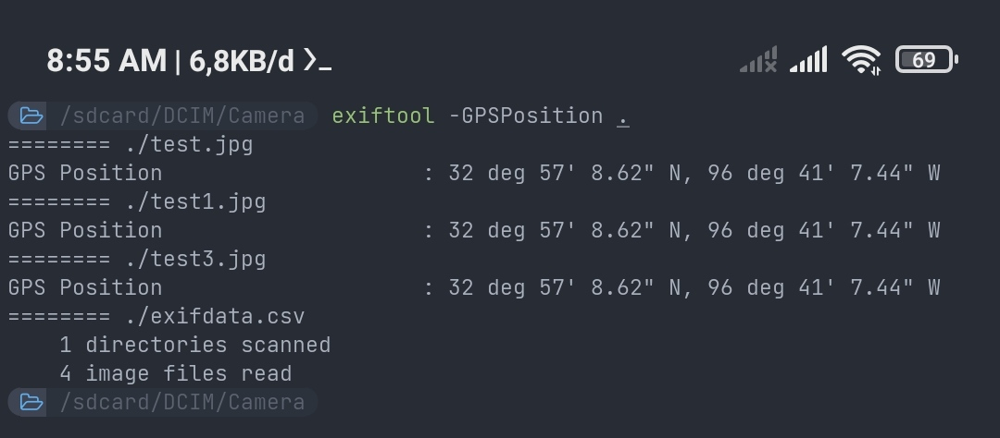
    
    **After**:
    
    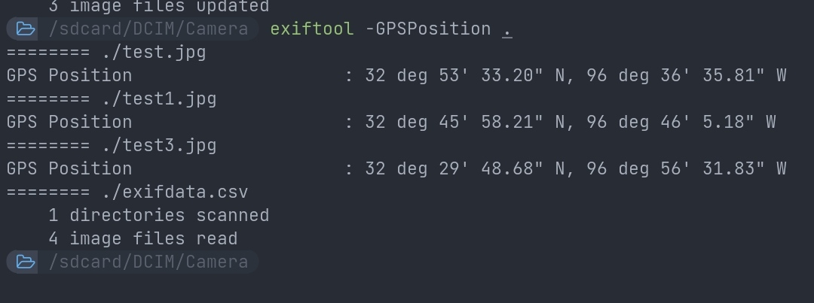
    
    This has been successfully changed, because we got different values ​​the first and last time checking, you may need more validation to see the changes in the photo, you can use other tools to check it if you are unsure about the changes.
    
Tutorial Made by QiubyZhukhi
